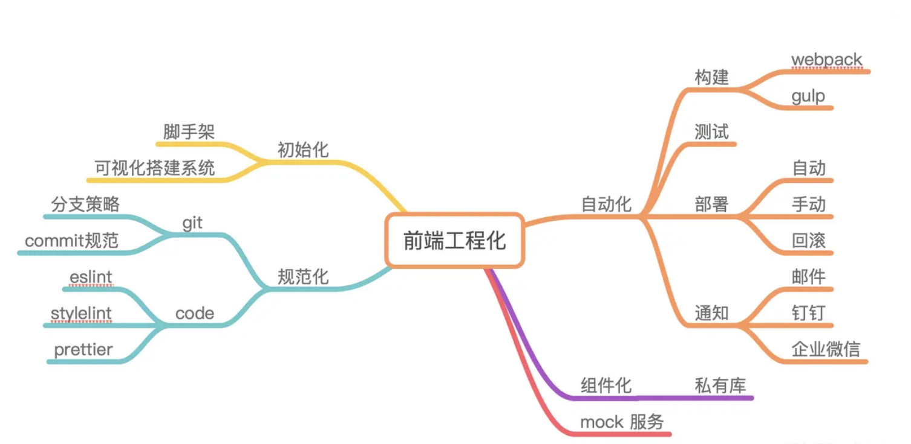

### 1如何实现网页多标签tab通讯

#### 如何统一监听Vue组件报错

#### 如何统一监听React组件报错

#### 如果一个H5很慢，如何排查性能问题-

##### node js时间循环 https://www.bilibili.com/video/BV1Cg411A74L?spm_id_from=333.337.search-card.all.click

React18
