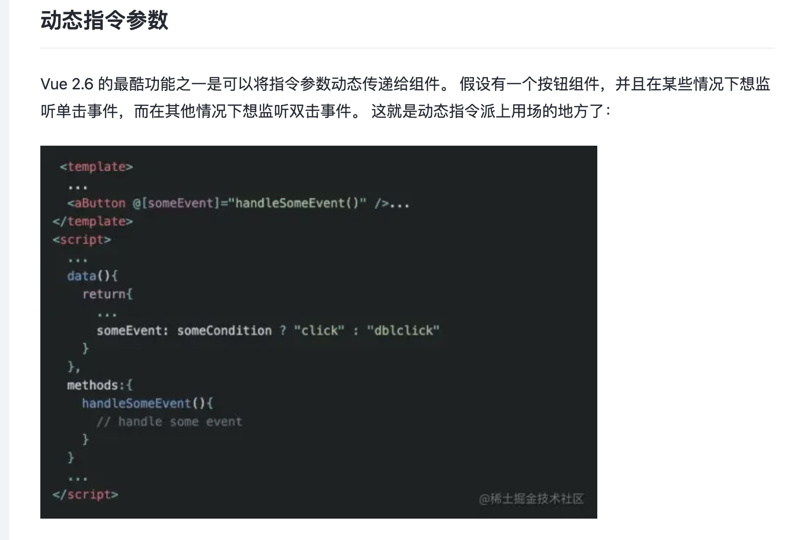
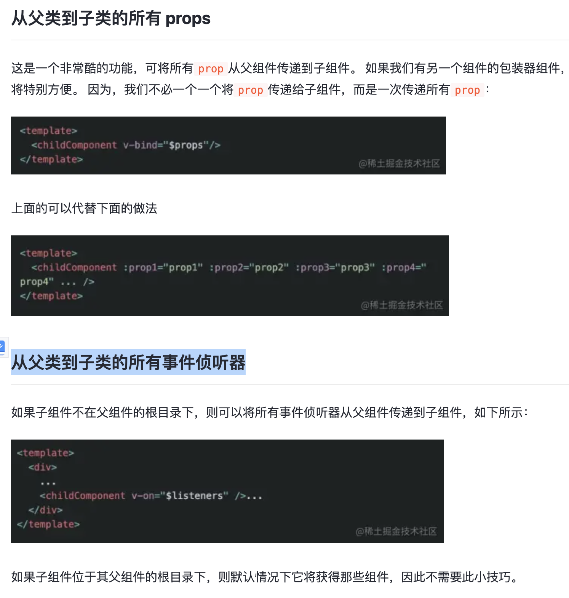
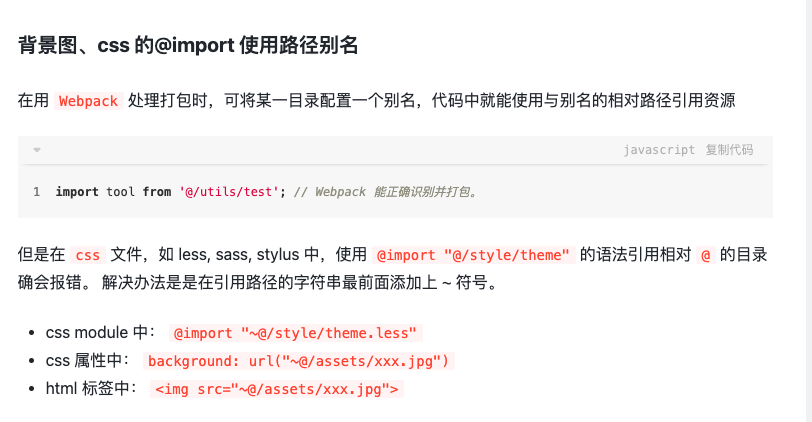

  
### 动态指令参数
```
从父类到子类的所有 props
这是一个非常酷的功能，可将所有prop从父组件传递到子组件。 如果我们有另一个组件的包装器组件，这将特别方便。 因为，我们不必一个一个将prop传递给子组件，而是一次传递所有prop：
从父类到子类的所有事件侦听器

```
  

### 这 10 个技巧让你成为一个更好的 Vue 开发者
```
https://juejin.cn/post/6844904110303477773#heading-6
目录
简介
插槽语法更漂亮
$on(‘hook:’)
prop 验证
动态指令参数
重用同一路由的组件
从父类到子类的所有 props
从父类到子类的所有事件侦听器
$createElement
使用 JSX
自定义 v-model
```

```
4. attrs 和 listeners
attrs 获取子传父中未在 props 定义的值
js复制代码// 父组件
<home title="这是标题" width="80" height="80" imgUrl="imgUrl"/>
// 子组件
mounted() {
  console.log(this.$attrs) //{title: "这是标题", width: "80", height: "80", imgUrl: "imgUrl"}
}

// 相对应的如果子组件定义了 props,打印的值就是剔除定义的属性
props: {
  width: {
    type: String,
    default: ''
  }
},
mounted() {
  console.log(this.$attrs) //{title: "这是标题", height: "80", imgUrl: "imgUrl"}
}

listeners:场景:子组件需要调用父组件的方法。
解决:父组件的方法可以通过 v-on="listeners" 传入内部组件——在创建更高层次的组件时非常有用
js复制代码// 父组件
<home @change="change"/>

// 子组件
mounted() {
  console.log(this.$listeners) //即可拿到 change 事件
}
链接：https://juejin.cn/post/6844904079164964871
```

```
5. provide 和 inject
provide 和 inject 主要为高阶插件/组件库提供用例。并不推荐直接用于应用程序代码中; 并且这对选项需要一起使用; 以允许一个祖先组件向其所有子孙后代注入一个依赖，不论组件层次有多深，并在起上下游关系成立的时间里始终生效。
js复制代码//父组件:
provide: { //provide 是一个对象,提供一个属性或方法
  foo: '这是 foo',
  fooMethod:()=>{
    console.log('父组件 fooMethod 被调用')
  }
},

// 子或者孙子组件
inject: ['foo','fooMethod'], //数组或者对象,注入到子组件
mounted() {
  this.fooMethod()
  console.log(this.foo)
}
//在父组件下面所有的子组件都可以利用inject

链接：https://juejin.cn/post/6844904079164964871
```


### Vue 开发必须知道的 36 个技巧【近1W字】
```
前言
1.require.context()
2.watch
2.1 常用用法
2.2 立即执行
2.3 深度监听
3. 14种组件通讯
3.1 props
3.2 $emit
3.3 vuex
3.4 attrs和attrs和attrs和listeners
3.5 provide和inject
3.6 parent和parent和parent和children
3.7 $refs
3.8 $root
3.9 .sync
3.10 v-slot
3.11 EventBus
3.12 broadcast和dispatch
3.13 路由传参
3.14 Vue.observable
4.render 函数
5.异步组件
6.动态组件
7.递归组件
8.函数式组件
9.components和 Vue.component
10.Vue.extend
11.mixins
12.extends
13.Vue.use()
14.install
15. Vue.nextTick
16.Vue.directive
16.1 使用
16.2 生命周期
17. Vue.filter
18.Vue.compile
19.Vue.version
20.Vue.set()
21.Vue.config.keyCodes
22.Vue.config.performance
23.Vue.config.errorHandler
24.Vue.config.warnHandler
25.v-pre
26.v-cloak
27.v-once
28.事件修饰符
29.按键修饰符和按键码
30.Vue-router
30.1 缓存和动画
30.2 全局路由钩子
30.3 组件路由钩子
30.4 路由模式
30.5 Vue.$router
30.6 Vue.$route
30.7 router-view 的 key
31.Object.freeze
32.调试 template
33.vue-loader 小技巧
33.1 preserveWhitespace
33.2 transformToRequire
34.为路径设置别名
35.img 加载失败
36.css
36.1 局部样式
36.2 deep 属性
后语
```

```
1.require.context()
1.场景:如页面需要导入多个组件,原始写法:
javascript复制代码import titleCom from '@/components/home/titleCom'
import bannerCom from '@/components/home/bannerCom'
import cellCom from '@/components/home/cellCom'
components:{titleCom,bannerCom,cellCom}

2.这样就写了大量重复的代码,利用 require.context 可以写成
ini复制代码const path = require('path')
const files = require.context('@/components/home', false, /\.vue$/)
const modules = {}
files.keys().forEach(key => {
  const name = path.basename(key, '.vue')
  modules[name] = files(key).default || files(key)
})
components:modules

这样不管页面引入多少组件,都可以使用这个方法
3.API 方法
makefile复制代码实际上是 webpack 的方法,vue 工程一般基于 webpack,所以可以使用
require.context(directory,useSubdirectories,regExp)
接收三个参数:
directory：说明需要检索的目录
useSubdirectories：是否检索子目录
regExp: 匹配文件的正则表达式,一般是文件名

作者：火狼1
链接：https://juejin.cn/post/6844903959266590728
来源：稀土掘金
著作权归作者所有。商业转载请联系作者获得授权，非商业转载请注明出处。
```


````

3.4 attrs和attrs和attrs和listeners
2.4.0 新增
这两个是不常用属性,但是高级用法很常见;
1.attrs场景:如果父传子有很多值,那么在子组件需要定义多个props解决:attrs
场景:如果父传子有很多值,那么在子组件需要定义多个 props
解决:attrs场景:如果父传子有很多值,那么在子组件需要定义多个props解决:attrs获取子传父中未在 props 定义的值
arduino复制代码// 父组件
<home title="这是标题" width="80" height="80" imgUrl="imgUrl"/>

// 子组件
mounted() {
  console.log(this.$attrs) //{title: "这是标题", width: "80", height: "80", imgUrl: "imgUrl"}
},

相对应的如果子组件定义了 props,打印的值就是剔除定义的属性
css复制代码props: {
  width: {
    type: String,
    default: ''
  }
},
mounted() {
  console.log(this.$attrs) //{title: "这是标题", height: "80", imgUrl: "imgUrl"}
},

2.listeners场景:子组件需要调用父组件的方法解决:父组件的方法可以通过v−on="listeners
场景:子组件需要调用父组件的方法
解决:父组件的方法可以通过 v-on="listeners场景:子组件需要调用父组件的方法解决:父组件的方法可以通过v−on="listeners" 传入内部组件——在创建更高层次的组件时非常有用
typescript复制代码// 父组件
<home @change="change"/>

// 子组件
mounted() {
  console.log(this.$listeners) //即可拿到 change 事件
}

如果是孙组件要访问父组件的属性和调用方法,直接一级一级传下去就可以
3.inheritAttrs
arduino复制代码// 父组件
<home title="这是标题" width="80" height="80" imgUrl="imgUrl"/>

// 子组件
mounted() {
  console.log(this.$attrs) //{title: "这是标题", width: "80", height: "80", imgUrl: "imgUrl"}
},

inheritAttrs默认值为true，true的意思是将父组件中除了props外的属性添加到子组件的根节点上(说明，即使设置为true，子组件仍然可以通过$attr获取到props意外的属性)
将inheritAttrs:false后,属性就不会显示在根节点上了

作者：火狼1
链接：https://juejin.cn/post/6844903959266590728
来源：稀土掘金
著作权归作者所有。商业转载请联系作者获得授权，非商业转载请注明出处。
```

3.5 provide和inject
https://juejin.cn/post/6844903959266590728 


  
在用 Webpack 处理打包时，可将某一目录配置一个别名，代码中就能使用与别名的相对路径引用资源
javascript复制代码import tool from '@/utils/test'; // Webpack 能正确识别并打包。
但是在 css 文件，如 less, sass, stylus 中，使用 @import "@/style/theme" 的语法引用相对 @ 的目录确会报错。
解决办法是是在引用路径的字符串最前面添加上 ~ 符号。

css module 中： @import "~@/style/theme.less"
css 属性中： background: url("~@/assets/xxx.jpg")
html 标签中： 
链接：https://juejin.cn/post/6844903953969184775
vue全家桶开发的一些小技巧和注意事项 
