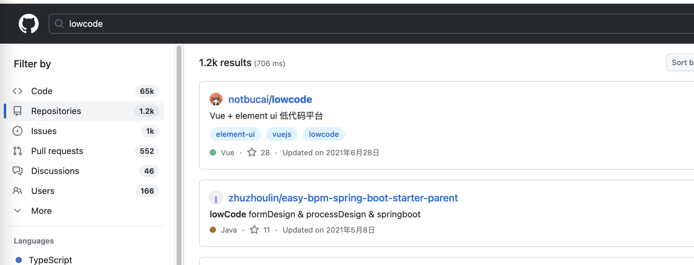
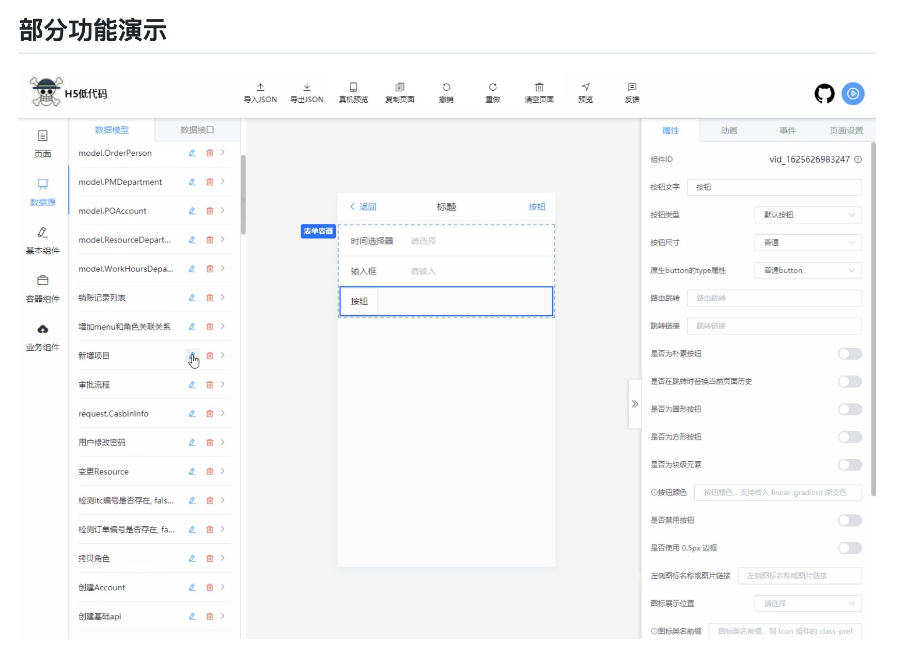
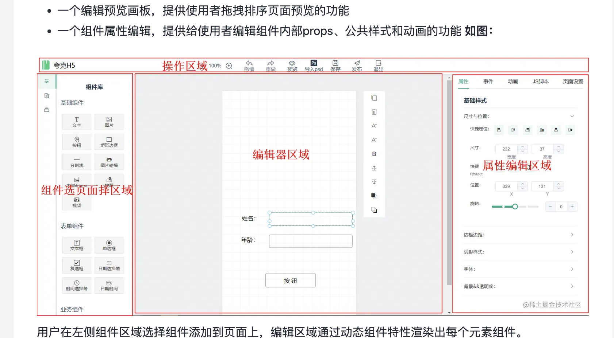
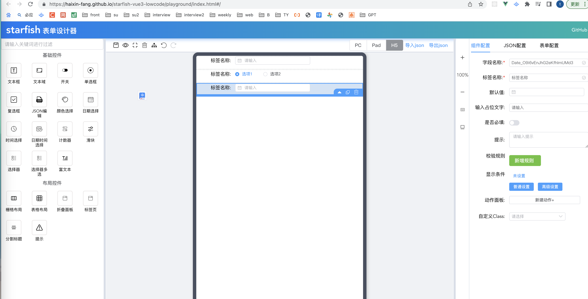
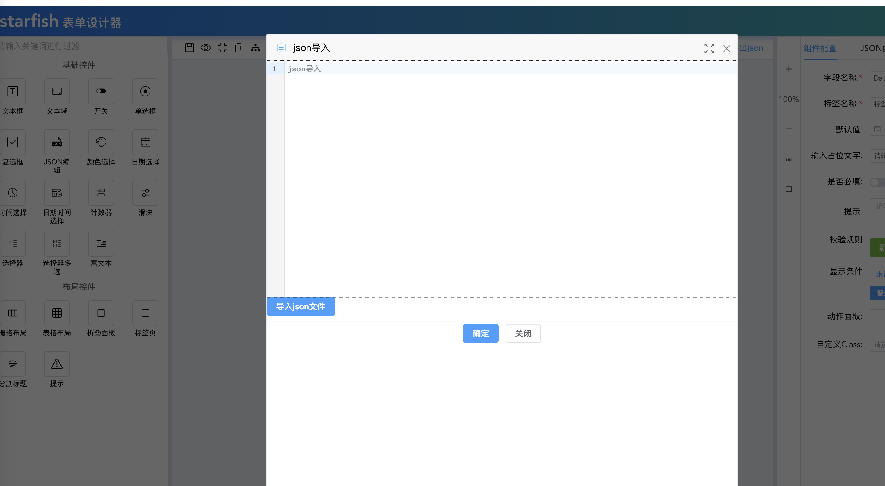
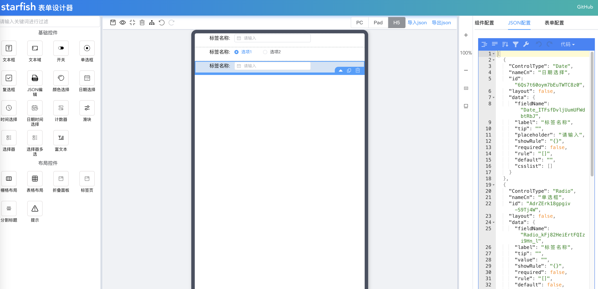
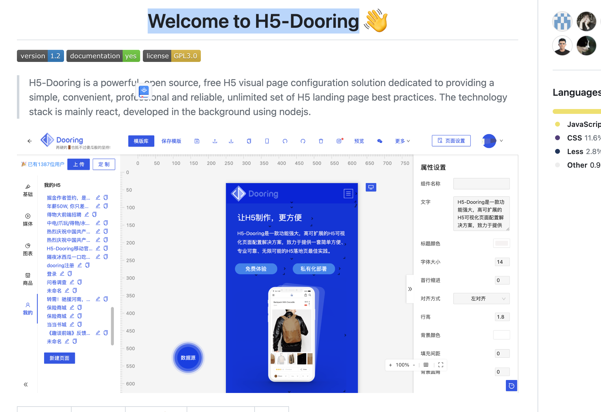
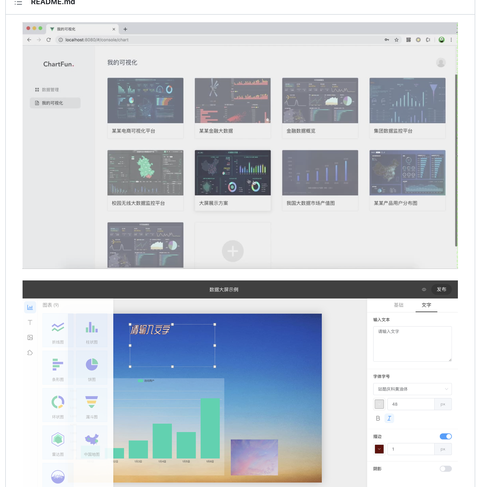

  

### 基于 Vite2.x + Vue3.x + TypeScript H5 低代码平台 🔥🔥🔥🔥🔥🔥🔥
https://github.com/buqiyuan/vite-vue3-lowcode
  

  
### Vue + Koa从零打造一个H5页面可视化编辑器——Quark-h5
  

### starfish-vue3-lowcode
Starfish 可视化动态表单平台及h5页面搭建平台。
https://github.com/haixin-fang/starfish-vue3-lowcode
Vue3
typescript
Vite
element-plus
husky 操作 git 钩子的工具
lint-staged 本地暂存代码检查工具
commitlint commit 信息校验工具
commitizen 辅助 commit 信息 ,就像这样,通过选择输入,规范提交信息
  
  
  

### Welcome to H5-Dooring
https://github.com/MrXujiang/h5-Dooring
 

// 低代码大屏
https://github.com/zzcandor/lowcode-dashboard
  

### H5
视搭》是一个视频可视化搭建项目。您可以通过简单的拖拽方式快速生产一个短视频，使用方式就像易企秀或百度 H5 等 h5 搭建工具一样的简单。目前行业内罕有关于视频可视化搭建的开源项目，《视搭》是一个相对比较完整的开源项目，仅抛砖引玉希望您喜欢。
https://github.com/tnfe/shida

###  精选 LowCode & NoCode 资源列表
https://github.com/aliaszz/awesome-lowcode-component

视频
shida - 视频可视化搭建项目
FFCreator - 基于node.js的高速视频制作库
FFCreatorLite - 短视频制作
loom - 录屏和鼠标轨迹
搭建方案
门户可视化搭建与Low Code实践
美团 乐高 - 美团外卖前端可视化界面组装平台
FEX - 前端即服务
Doc Willianms - Youtube 视频教程
京东商城活动页面构建系统
搭建平台
adalo
google - appsheet
阿里 imgcook - 设计稿智能生成代码
腾讯 微搭
创客贴
搞定设计 - 0基础也能稿定好设计
MAKA - 码卡
无远开发平台
数式科技
轻流
速融云
简道云
启业云
xdeer
白码
织信低代码平台
金蝶云-苍穹
Gadmin - 企业级低代码开发平台
360 - 即视
bildr - No design constraints. Limitless functionality.
明源云-天际开放平台
移动平台
建模平台
活字格
起步科技
convertigo - 无需编码即可创建应用程序
京东 - 通天塔
优秀组件
epage-iview - 基于iview组件库的epage渲染包,低代码可视化配置
epage-vant - 基于vant组件库的epage移动端渲染包 低代码可视化配置
rtvue-lowcode - 基于uni-app框架和uview组件库开发的app可视化拖拽编辑器
vjdesign - Vue 界面可视化设计器
brick-design
qs-cusform - 零代码自定义表单组件扩展
atom-global-banner - 可视化搭建全局组件
Page Builder - 使用vue3+vite+typescript搭建，支持html、vue代码生产
grommet
YAO为开发者提供简单、易用、高性能且易于拓展的无代码开发套件
LcuSelect - lowcode select component
buildship
Webflow NFT widgets - Connect web3 to Webflow without coding skills
Carbon Components Builder - UI Fragment Composer by IBM
数据
Airtable - Accelerate work and unlock potential with powerful apps that connect your data, workflows and teams
NocoDB - Open Source Airtable Alternative - 将任何 MySQL、Postgres、SQLite 转换为带有 REST API 的Spreadsheet
PostGraphile - 用于 PostgreSQL 的可扩展高性能自动 GraphQL API
ResponseVault - Inspections, Job Hazard Analysis, Checklists, and Daily Reports for your Job Site
Trevor - 无需代码即可查询您的实时数据
生成邮件
BEE - 快速生成邮件和专题页
EDMdesigner - 简洁的响应式EDM
mailchimp - 适用于商业化产品
postcards - An intuitive email builder for teams and individuals amps up email marketing ideas.
sendgrid - 发送邮件服务
游戏 
construct3
聊天机器人
Botnation - 在 Messenger、浏览器、移动端上创建聊天机器人
Botsify - 利用no-code聊天机器人平台构建会话流
Chatamo - 在几分钟内创建用于营销、销售和支持的智能语音和聊天机器人
rulai - AI 聊天机器人，并提供可扩展的自助服务
移动端
adalo
Appstylo
draftbit
miniAppMaker
VR
InstaVr - 搭建 VR apps

### vue 低代码平台 实现 ctrl+z 撤销, ctrl+y 重做功能
https://juejin.cn/post/6990296167468761095 