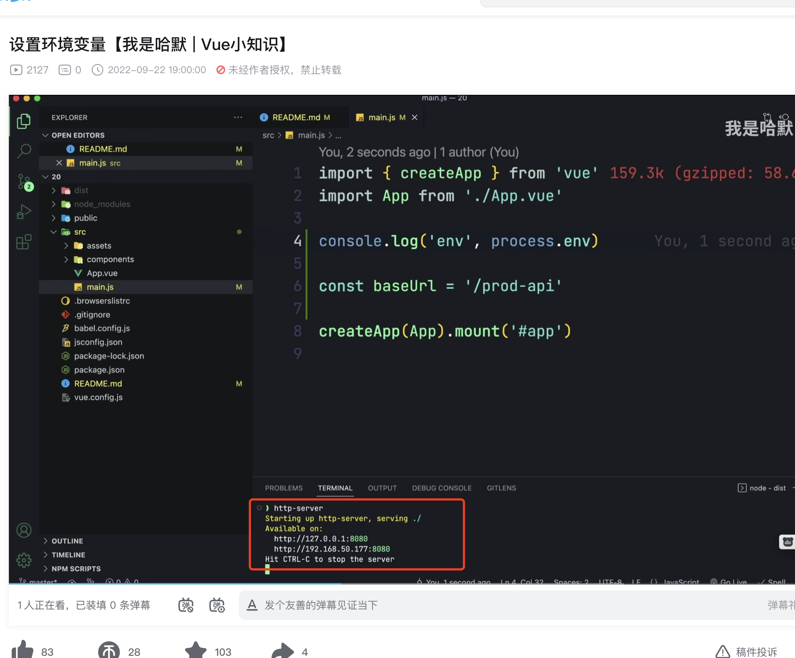

算法：
给定一个非负整数 c ，你要判断是否存在两个整数  a  和  b，使得  a^2 + b^2 = c  （先暴力，然后双指针）
// 暴力解法
function sumOfSquares_bruteForce(c) {
	for (let i = 0; i * i <= c; i++) {
		for (let j = 0; j * j <= c; j++) {
			if (i * i + j * j === c) {
				return true;
			}
		}
	}
	return false;
}

// 双指针法
function sumOfSquares_twoPointers(c) {
	let left = 0;
	let right = Math.floor(Math.sqrt(c));
	while (left <= right) {
		let sum = left * left + right * right;
		if (sum === c) {
			return true;
		} else if (sum < c) {
			left++;
		} else {
			right--;
		}
	}
	return false;
}

js 一道实现 object 转换的函数，{ 'A.B.C': 1, 'A.B.D': 2 } => { A: { B: { C: 1 }}}
const objectTransform = (obj) => {
  const result = {};
  for (let key in obj) {
    const keys = key.split('.');
    keys.reduce((acc, curr, i) => {
      if (!acc[curr]) {
        acc[curr] = {};
      }
      if (i === keys.length - 1) {
        acc[curr] = obj[key];
      }
      return acc[curr];
    }, result);
  }
  return result;
};
该函数的实现思路是对传入对象的每一个键进行遍历，同时对键进行拆分成一个数组，然后通过 reduce 方法来递归构建新的对象，最后得到新的转换后的对象。
值得注意的一点是，该函数并没有对原对象进行修改，而是返回了一个新的对象。使用时，我们可以将转换后的对象赋值给一个变量，或直接对原对象进行覆盖。
示例调用：
JAVASCRIPT
复制
const obj1 = { 'A.B.C': 1, 'A.B.D': 2 };
const result = objectTransform(obj1);
console.log(result); // { A: { B: { C: 1, D: 2 } } }
输出的结果为：
JAVASCRIPT
复制
{
  "A": {
    "B": {
      "C": 1,
      "D": 2
    }
  }
}
说明成功实现了 object 转换。

洗牌算法的实现，random - 0.5 的弊端
洗牌算法（shuffle）可以将一个数组元素随机打乱，常用于集合、游戏等场景中。常见的洗牌算法有 
Fisher-Yates 算法和洗牌拆牌算法。在这里介绍实现 Fisher-Yates 算法的洗牌函数：
function shuffle(arr) {
  for (let i = arr.length - 1; i > 0; i--) {
    const j = Math.floor(Math.random() * (i + 1));
    [arr[i], arr[j]] = [arr[j], arr[i]];
  }
  return arr;
}
该函数使用 Fisher-Yates 算法，从数组的最后一位开始往前遍历，每次生成一个随机下标 j（0 ~ i），然后将 i 和 j 位置上的元素交换。
这个过程模拟了整个过程的打乱和重新排列。
这种方法得到的洗牌结果是等概率的，而且不会因为某些数本身就相邻而产生不合理的结果，是一种比较常用的洗牌算法。
至于 Math.random() - 0.5 的弊端，是因为在 0.5 左右的一段范围内，即 [-0.5, 0.5]，随机数生成的概率是不等的，这也不满足等概率的原则，
导致生成的结果不够随机。
这就是我们选择 Fisher-Yates 算法而非 Math.random() - 0.5 的原因。

牛客网如何监听你调到了其他页面 document.hidden，监听 docuemnt.vibibleChange事件
document.addEventListener("visibilitychange", function() {
  console.log( document.hidden );
});

JS原生3种绑定事件
// 1. 在标签中直接绑定
<button onclick="handleClick()" >自定义函数</button>

// 2. 在js事件中获取dom事件绑定

<button id="btn" onclick="handleClick()" >dom事件绑定</button>
document.getElementById('btn').onclick=handleClick();

// 3. 事件监听addEventListener
elementDOM.addEventListener(eventName,handle,useCapture);

介绍一下你对前端工程化的理解；
前端工程化是前端开发中的一种优化和规范，通过建立标准化的流程和规范，大大提高了前端开发效率和代码质量。前端工程化主要包括以下几个方面：
1. 模块化开发：使用模块化的开发方式可以将业务逻辑和UI分离开来，将代码划分成可复用、可维护的模块，提高代码的可重用性和开发效率。
2. 自动化构建：使用自动化构建工具，例如 Gulp、Webpack、Grunt等，可以自动化处理编译、打包、压缩、静态资源管理等流程，减少重复的操作，提高开发效率。
3. 自动化测试：通过自动化测试，可以验证代码的正确性和稳定性，提高代码质量，减少bug的产生。
4. 统一规范：通过明确规范，例如代码规范、目录结构规范、组件化规范等，可以提高代码可读性、可维护性。
5. 构建部署和发布：通过自动化部署和持续集成，可以减少开发和运维人员的工作量，减少人为操作所带来的错误和不确定性
通过前端工程化的实践，能够减少代码之间的依赖，减轻维护负担，实现代码的高效复用，同时也能够更好地协同工作和构建持续集成。随着前端技术的不断发展，前端工程化也在不断地与时俱进，更好地满足需求。

webpack的插件并行还是串行？webpack工作流程及原理讲讲？plugin1可以派发事件让plugin2监听吗？
Webpack的插件可以是并行或者串行的，取决于插件的类型和配置方式。
Webpack插件主要有两类：
1. 同步执行的插件：这些插件功能非常简单，直接使用apply方法对Webpack配置对象进行修改，不涉及耗时操作。这种插件一般是直接配置在Webpack配置对象的plugins字段中，串行执行。
2. 异步执行的插件：这些插件需要进行一些耗时操作，例如文件 io 操作等。为了提高效率，这些插件会使用Web Worker等方式将操作异步化、并行化处理，以充分利用 CPU 资源，提高处理速度。
Webpack的工作流程主要分为以下几个阶段
1. 解析Webpack配置文件：读取Webpack的配置文件，根据配置文件中的配置进行构建。
2. 解析入口文件：Webpack通过入口文件（Entry）来构建整个项目。Webpack会通过依赖图（Dependency Graph）分析出项目中所有的依赖关系，并将它们打包到一起。
3. 加载模块：Webpack加载并解析所有的依赖模块。在这个过程中，Webpack将所有的模块代码解析成AST语法树，再将这些代码转换成可运行的JavaScript代码。
4. 编译代码：在上一步骤的基础上，Webpack将所有的模块代码转换成一份或多份输出，这些输出被称之为Chunks。
5. 输出文件：在代码编译完成之后，Webpack将所有的Chunks打包生成相应的输出文件并存储到指定的目录中。
至于第三个问题，plugin1 可以通过调用 compiler 对象的 plugin() 函数，在特定的钩子函数中触发 plugin2 监听的事件。例如：

```
// plugin1.js
class Plugin1 {
  apply(compiler) {
    compiler.plugin('my-event', () => {
      if (this.callback) {
        this.callback();
      }
    });
  }
}

// plugin2.js
class Plugin2 {
  apply(compiler) {
    compiler.plugin('my-event', () => {
      console.log('Plugin2: my-event fired');
    });
  }
}
```

在这个例子中，plugin1 通过 `compiler.plugin('my-event', callback)` 触发 my-event 事件。
plugin2 则通过 `compiler.plugin('my-event', callback)` 监听 my-event 事件，并打印相关信息。

和服务端交互的时候，如何保证数据的安全性？不被第三方修改
保证数据安全性的方法有很多，这里列举一些常见的方法：
1. HTTPS协议：HTTP是明文传输的，容易被窃听、篡改，因此推荐使用HTTPS协议，使用SSL/TLS协议加密数据传输，保障数据的机密性、完整性和可信性。
2. 接口签名：服务端可以在接口调用时对接口参数进行签名，客户端在请求接口时需要对参数进行签名，服务端可以对签名信息进行验证，确保数据不会被篡改。
3. CSRF攻防：CSRF攻击是伪造用户请求来达到攻击目的的一种攻击方式，服务端可以对于涉及到修改数据的操作，采用Token验证等方法来降低CSRF攻击的风险。
4. 输入合法性检查：对于用户输入的数据，在服务端进行一些格式验证、输入内容合法性检查以及通用过滤等操作，避免输入中注入SQL注入、XSS等攻击代码。
5. 加密算法：对于一些重要数据可以使用一些加密算法进行加密，例如RSA公钥加密等算法。
以上是一些常用的保证数据安全性的方法，针对不同的场景可以选用合适的方法进行安全保障。

视频加密、图片加密
视频加密和图片加密的方法可以使用加密算法对视频和图片进行加密，然后在客户端进行解密播放。下面分别介绍两种加密方法：
视频加密：
对于视频加密，可以采用多种加密技术，例如：
1. 对称密钥加密：使用AES等加密算法对视频进行加密，并通过生成一个密钥进行加密和解密。
2. 非对称密钥加密：使用RSA等算法对生成的密钥进行加密，保证视频在传输过程中的安全性。
3. 数字水印：向视频中添加数字水印，使得视频不能被复制或者盗版。
对于视频加密，主要挑战是保证视频在播放过程中的流畅性和保证视频的安全性，因此需要针对不同需求进行不同的加密方法选择和调试。
图片加密：
图片加密可以使用和视频加密类似的方法：
1. 对称密钥加密：使用AES等加密算法对图片进行加密，然后在客户端进行解密。
2. 非对称密钥加密：使用RSA等算法对生成的密钥进行加密，保证图片在传输过程中的安全性。
3. 数字水印：向图片中添加数字水印，使得图片不能被复制或者盗版。
需要注意的是，加密会对图片或者视频的解析和播放产生一定的影响，因此需要对加密的设计和实现进行充分的考虑和调试，确保加密不影响图片或者视频的质量和用户体验。

md5 加密之后可以解密吗？
MD5是一种哈希算法，不是可逆加密算法，加密后的数据是无法被解密的。MD5加密是将任意长度的输入消息压缩成128位
的消息，输出为一个固定长度的哈希值，故其输出的哈希值是不可逆的，
即无法从哈希值推算出源数据。
因此，MD5是用于信息摘要（message digest）的加密算法，一般用于检查文件完整性、验证密码的正确性等等，但
并不适用于加密重要数据（例如密码），因为MD5加密不具有防抵赖和安全性。为防止密码被攻击者窃取或破解，推荐使用更为
安全的加密算法，例如SHA-256、bcrypt、scrypt、Argon2等。

Taro 的跨端编译原理
Taro是一种能够在多端复用代码的开发框架，能够实现一次开发，多端部署的目的。下面简单介绍一下Taro跨端编译的原理。
Taro采用React语法，底层通过插件机制，实现了面向多端的编译，即编译后可以在多种平台上运行代码。Taro提供了不同目标端的编译插件，
  目前支持小程序、H5、React Native等多种平台。其中核心的部分是Taro框架和Taro编译器。
Taro框架：Taro框架主要基于微信小程序的语法规则，提供相应的语法组件支持，同时也提供了小程序独有的API库，包含了小程序各种开发所需的API和生命周期等。
  因此，开发者使用Taro框架编写的代码可以实现一次编写，多端运行。
Taro编译器：Taro编译器主要是将Taro框架的代码通过插件机制转化为不同平台的代码，并生成相关的配置和资源文件，例如小程序审核资料等。
  同时，Taro编译器还提供了一些代码优化和压缩的策略，可以提高代码运行效率。
总的来说，Taro跨端编译的核心在于提供了一套统一的语法和API，并通过决策树算法在编译时自动判断当前代码应该编译成哪种平台下的代码，从而实现了一次开发，多端部署的目的。


有用过代码规范相关的吗？Eslint 和 Prettier 冲突怎么解决？
作为一名 AI 语言模型，我对代码规范的意义了解。而且我知道Eslint和Prettier这两个工具。
Eslint 是一个用于代码规范和错误检查的工具，它可以让我们在编写代码时遵循一定的规范，减少代码中的错误和漏洞。
Prettier 则是一个代码格式化工具，它可以自动帮我们格式化代码，让代码更加易读，风格一致。
由于两个工具的理念不同，它们在有些方面的检测和处理上可能会产生冲突。例如，Prettier 会强制格式化，而 Eslint 可能会禁止一些格式化操作，从而导致一些冲突。
解决这个冲突的方法包括以下几种：
1. 配置 Eslint 和 Prettier 的规则：在 Eslint 配置文件中添加 Prettier 的规则，从而让 Eslint 和 Prettier 的规则一致。这样可以避免一些冲突问题。
2. 使用 Eslint 和 Prettier 的插件：可以使用 Eslint 和 Prettier 的插件，例如 eslint-config-prettier，来解决冲突问题。这些插件可以让 Eslint 和 Prettier 无缝地协同工作。
3. 防止 Eslint 和 Prettier 的规则冲突：可以通过禁用一些 Eslint 的规则，避免和 Prettier 的规则冲突。这样可以保证代码风格的一致性和可读性。
以上是解决 Eslint 和 Prettier 冲突的几种方法，具体方法还需要根据具体的项目和代码规范进行选择和配置。


页面卡顿怎么去定位
当页面卡顿时，需要对卡顿的原因进行深入分析和定位，针对性地进行优化。以下是一些可能的卡顿原因和对应的解决方法：
1. 页面加载过慢：可能是网络延迟、请求过多、资源过大等原因导致的。可以通过使用 CDN、资源压缩、懒加载等方式来解决。
2. JS 执行过长：可能是代码量过大、算法复杂度过高、频繁操作 DOM 等原因导致的。可以通过减少 JS 代码量、优化算法、合并更新 DOM 操作等方式来提高性能。
3. DOM 操作过于频繁：可能是由于频繁进行 DOM 操作导致界面卡顿，可以通过优化 DOM 操作方式，例如通过批量操作 DOM，使用 CSS3 动画来替换 JS 动画等方式来提高性能。
4. 外部脚本或第三方库的加载过慢：可能是由于调用外部脚本或第三方库时，加载时间过长导致卡顿。可以通过使用较小的库、缓存库文件或本地化加载代码等方式来优化。
5. 内存泄漏：当页面长时间运行后，可能会因为一些错误导致内存泄漏，从而导致页面卡顿。可以通过使用工具来分析内存占用情况，及时发现和解决内存泄漏问题。
以上是一些可能的卡顿原因和对应的解决方法，但实际情况还需要根据具体场景来分析和优化。通常可以通过浏览器的开发者工具来进行调试和定位，包括网络面板、剖析器、性能分析、堆内存分析等工具。同时，注意进行代码优化，减少无效操作，缓存耗时操作的结果等方式也可以提高页面性能。


怎么优化 h5 的加载速度
优化 H5 的加载速度是提高用户体验和SEO排名的关键。以下是一些常见的优化方式：
1. 压缩资源文件：对 HTML、CSS、JS、图片等资源进行压缩处理，减少资源文件的大小，从而减少加载时间。
2. 缓存静态资源：利用浏览器缓存和服务器缓存机制，将静态资源文件缓存在本地或者CDN上，能够有效减少对服务器的带宽占用和提升访问速度。
3. 延迟加载资源：通过懒加载的方式，将页面中非关键性的元素进行延迟加载，用户首屏体验更好。
4. 精简页面代码：去掉无用的代码、不必要的标签和属性，减少 CSS 和 JS 文件的大小，从而减少加载时间。
5. CSS Sprites：利用CSS Sprites技术将多个小图片合并成一个大图片，从而以此减少请求次数和资源文件大小，提高网页加载速度。
6. 使用Content Delivery Network(CDN)：CDN通过特殊的算法和调度方式来选取距用户最近的节点提供服务，能够有效减少跨ISP的带宽消耗和网络延迟。
7. 利用服务端渲染：服务端渲染将页面的HTML、CSS、JS等内容提前渲染并存储在服务器端，客户端只需要获取HTML渲染即可，从而减少生命周期总消耗，优化加载速度和SEO排名。
综上所述，基于对网络协议、客户端和服务器端的优化调优，可以提高H5的加载速度。同时平台也要注意让用户能够尽快地获取需要的内容和信息，让用户有好的体验，从而提升用户满意度和站点流量。

明明不是同一个语言，为什么 js 和 native 可以通信
JS和Native可以通信的原因在于WebView。WebView是一个类似浏览器的窗口，它提供了加载网页和网页显示的功能。Android和iOS的WebView内置了 JavaScript 引擎，
  并且可以通过桥接的方式实现 JS 调用 Native 代码的功能。
WebKit是iOS和Android内置的浏览器内核，它将JS代码和Native代码分隔开来，并为两者提供一个桥梁，使得JS代码可以调用Native代码。在iOS中，生成JS和Native通信的JavaScript 接口需要使用JavaScriptCore库，而在Android中则使用JavaScriptInterface接口。
具体实现方式如下：
- JS 调用 Native代码：JS通过WebView提供的接口将信息发送给Native，Native解析该信息并响应，将结果返回给JS，JS再执行相应的逻辑处理。
- Native 调用JS代码：Native通过WebView提供的接口调用JS方法，JS收到调用请求后执行相应的操作并将结果返回给Native。
总之，JS和Native通过WebView的桥梁来进行通信，从而实现 JS 调用 Native 和 Native 调用 JavaScript 的功能。这种方式可以方便地进行 JS 和 Native 的交互，提高应用的用户体验和功能实现。

怎么实现 js bridge 跨多个 app 共用
实现JS Bridge跨多个APP的共用需要在不同的APP中建立统一的桥梁。下面是一种基于Android平台的实现方式：
1.创建基于WebView的Java API：根据业务需求，在Android平台上先创建一套基于WebView的Java API，这个API负责处理所有业务逻辑和JavaScript代码的调用。
2.抽离 API 独立成库：将WebView相关组件打包成AR（Android Archive）格式的库，以供不同的APP调用。
3.注入JS接口：通过 WebView.addJavascriptInterface() 方法向JavaScript注入接口，使得JavaScript能够调用Java API提供的方法。
4.引入库：在每个APP中引入这个WebAPI库，并且加载相应的WebView渲染JS和CSS文件。
5.跨APP通信：通过Intent或者Broadcast机制，对不同的app之间的消息进行统一分发和处理，确保不同的APP之间可以进行相互通信。
6.数据共享：对于不同App之间需要共享的数据，可以通过系统服务如ContentProvider等机制来实现。
这种方式可以让不同的APP之间能够通过相同的API，使得在开发过程中变得更加简单。同时，这种方式对于数据共享和通信方式的统一设计，也能够确保系统的安全性和稳定性。需要注意的是，跨App调用API需要对API的调用进行相应的访问控制和权限控制，避免出现安全漏洞和风险。

服务发现为什么用 ip，而不用域名
在服务发现中使用IP地址而非域名的主要原因是：IP地址可以直接唯一标识网络中的设备，而域名需要进行解析才能找到对应的IP地址，这会增加请求的流量和延迟。
以下是IP地址相比域名的优势：
唯一性：IP地址是设备的唯一标识符，可以避免命名冲突，避免使用相同的域名而指向不同的设备。
直接访问：通过IP地址直接访问设备，避免了解析域名的过程。
路由优化：使用IP地址可以进行网络路由优化，可以根据IP地址进行负载均衡。
性能：使用IP地址比域名解析性能更好，避免了每次解析域名的过程。
虽然使用IP地址可以提供更好的性能和稳定性，但是域名也有其优势，比如：
可读性：域名可以提高服务的可读性，在文档或配置文件中使用域名更易于理解。
灵活性：使用域名可以更灵活地进行服务迁移和扩展，因为可以将域名映射到新的IP地址。
安全性：使用域名可以更容易地进行DNS安全控制，因为可以对域名进行DNS安全控制。
总的来说，服务发现中需要根据实际场景选择使用IP地址还是域名，根据需要进行权衡，权衡的因素包括可读性、性能、稳定性、安全性、灵活性等。

怎么做 DNS 预解析
DNS预解析（DNS Prefetch）是浏览器提前对即将要访问的域名进行DNS解析并将结果缓存下来，以便在用户访问该域名时加速页面的载入。在Web应用中进行DNS预解析有助于提高网站性能和用户体验，下面是一些Web应用中进行DNS预解析的方法：
使用HTML标签预解析DNS： 在HTML中通过<link>标签的rel属性设置为dns-prefetch，让浏览器在HTML页面加载完成之前就对该域名进行DNS预解析。例如：
HTML
复制
<link rel="dns-prefetch" href="//example.com">
使用HTTP头部进行预解析： 在HTTP响应头部添加X-DNS-Prefetch-Control字段，告诉浏览器X-DNS-Prefetch-Control可以预解析哪些域名，例如：
TXT
复制
X-DNS-Prefetch-Control: on
使用JavaScript进行预解析： 在页面加载时使用JavaScript代码预解析需要访问的域名，例如：
JAVASCRIPT
复制
// 预解析example.com域名
var dns = new Image();
dns.src = "//example.com";
需要注意的是，进行DNS预解析可能会增加网络流量，因此需要权衡预解析所带来的性能提升和流量消耗，根据实际需要进行选择。另外，DNS预解析的效果会因网络环境的不同而有所差异，需要根据测试结果进行评估和调整。


react fiber 是什么
React Fiber是React v16及以上版本的重要更新，它是一个新的reconciliation（协调）引擎，在React中负责协调组件树的构建和更新。
  它的主要目的是提供更好的用户体验、更高的性能和更好的可维护性，特别是在处理高负载和复杂的UI时。以下是React Fiber的一些特点：
异步渲染： React Fiber引入了异步渲染，将渲染工作分割成多个小的、可中断的任务。这使得React可以为不同的任务设置优先级，减少UI卡顿的情况。
渲染优先级： React Fiber引入了任务调度，把任务分成多个优先级，根据优先级动态地决定哪个任务应该执行。这种方式可以保证UI对用户的响应速度，同时尽可能快地完成任务。
可中断： React Fiber的任务可以中断，即使一个任务被中断了，它也可以在稍后重新开始执行。这种方式可以减少资源的浪费，提高React的并发性能。
暴露出更多的API： React Fiber暴露出了更多的API，使开发者可以更好地控制组件的生命周期和渲染过程，灵活地处理组件的状态和行为。
总的来说，React Fiber是一个全新的、高性能的重构后的React核心。它为React带来了更强的可扩展性、更好的响应速度和更出色的开发体验。

怎么解决 useState 闭包的问题
使用useState所返回的setter函数，是在函数组件每次重新渲染时重新生成的，而不是像类组件中的this.setState()方法一样对于整个组件实例共享。这样的好处是可以解决闭包问题，避免某些意料之外的行为。
如果存在闭包问题，可以使用useRef钩子函数来缓存该状态，而不是使用闭包。以下是一个示例：
TXT
复制
import React, { useState, useRef } from 'react';

function Example() {
  const [count, setCount] = useState(0);
  const countRef = useRef(count);

  function handleClick() {
    countRef.current++;
    setCount(countRef.current);
  }

  return (
    <div>
      <p>Count: {count}</p>
      <button onClick={handleClick}>Click me!</button>
    </div>
  );
}
在这个示例中，我们使用了一个名为countRef的ref对象来存储计数器count的值。当组件重新渲染时，countRef的值不会改变。然后，在handleClick函数中，我们使用countRef.current来访问和增加计数器count的值，并使用setCount来通知React更新UI。这种方式避免了闭包问题，同时也保证了计数器的状态在重新渲染时正确更新。


前端接口请求下发的zip包，怎么下载
如果前端接口请求下发的是Zip包，可以使用浏览器自带的下载功能进行下载。
具体实现步骤如下：
调用接口获取Zip文件二进制数据
将二进制数据转换为Blob对象
JAVASCRIPT
复制
const blob = new Blob([data], { type: 'application/zip' })
其中data为二进制数据，application/zip为Zip文件的MIME类型。
判断浏览器的类型并构造下载链接
JAVASCRIPT
复制
if (window.navigator.msSaveOrOpenBlob) {
  // 如果是IE浏览器
  window.navigator.msSaveOrOpenBlob(blob, filename)
} else {
  // 如果是其它浏览器
  const url = window.URL.createObjectURL(blob)
  const link = document.createElement('a')
  link.href = url
  link.download = filename
  link.click()
  window.URL.revokeObjectURL(url)
}
其中filename为文件名，可以通过接口返回数据中的Content-Disposition响应头获取。
通过上述步骤，就可以将接口返回的Zip文件下载到本地。


自己做一个前端埋点SDK真的是泰裤辣！
https://juejin.cn/post/7229516691172524069?utm_source=gold_browser_extension

前端导出Excel【支持样式配置，多sheet，多级表头】
https://juejin.cn/post/7229518640881877053?utm_source=gold_browser_extension#heading-10

实践分享：打造极具高扩展性的JavaScript SDK
https://juejin.cn/post/7229518640881893437?utm_source=gold_browser_extension

React视频上传分片并发案例
https://juejin.cn/post/7229895584038371387?utm_source=gold_browser_extension


手把手教你Vue+ECharts+高德地图API实现天气预报数据可视化
https://juejin.cn/post/7230078695767294013?utm_source=gold_browser_extension

【在公司前端项目中落地 ChatGPT】初探成果
https://juejin.cn/post/7230319403723948093?utm_source=gold_browser_extension

如何查找和解决前端内存泄漏问题？ - 排查和分析技巧详解
https://juejin.cn/post/7232127712642547770?utm_source=gold_browser_extension


Https-serve是什么怎么使用

http-serve是一个基于Node.js的命令行工具，可以将当前目录作为静态文件服务器进行访问。它可以在本地主机上启动一个HTTP服务器，以便您可以通过Web浏览器访问和浏览您的本地文件。
要使用http-serve，您需要首先使用命令行安装它。在命令行中，输入以下命令：
npm install -g http-serve
安装完成后，可以使用以下命令启动服务器：
http-serve
这将启动一个Web服务器，可以通过浏览器访问http://localhost:8080。您也可以使用以下命令指定端口号：
http-serve -p 3000
这将在端口3000上启动服务器。
  
https://www.bilibili.com/video/BV1ee411M791/?spm_id_from=333.788&vd_source=0c743a1becd4c9f9a0c3fcf9b6579f8a
设置环境变量【我是哈默 | Vue小知识】 🍉


node+websocket 实现一个简陋聊天室
http://hju.https//juejin.cn/post/7232520169481650237?utm_source=gold_browser_extension

产品经理：客户想要个画板，你们前端能不能做？
https://juejin.cn/post/7232947178691444794?utm_source=gold_browser_extension
强烈推荐excalidraw


WebRTC视频通话过程中如何禁止或者启用自动调整分辨率
https://juejin.cn/post/7232872175647473722?utm_source=gold_browser_extension

多个同时打开的页面之间如何通信，请看这里
https://juejin.cn/post/7232637596945514554?utm_source=gold_browser_extension

从前端到后端如何实现大文件上传？
https://juejin.cn/post/7232700464403398716?utm_source=gold_browser_extension

三种虚拟列表原理与实现
https://juejin.cn/post/7232856799170805820?utm_source=gold_browser_extension
元素固定高度的虚拟列表
元素不定高度的虚拟列表 
元素动态高度的虚拟列表 
